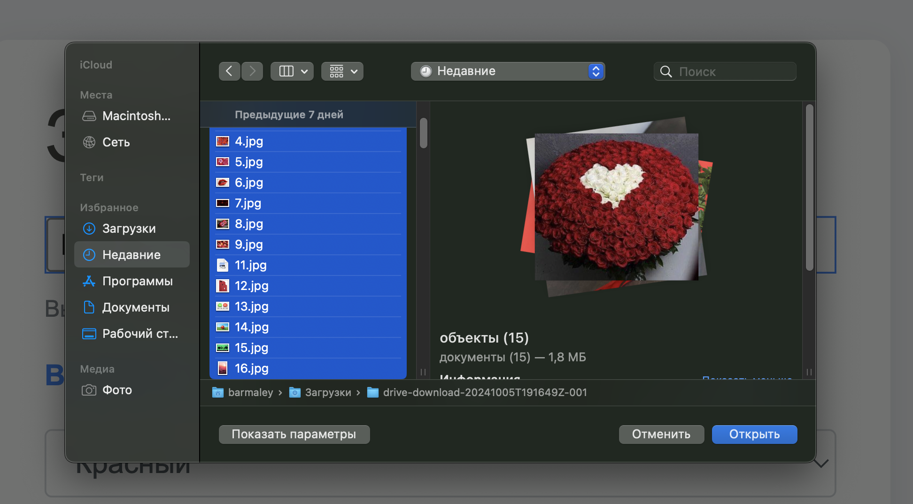
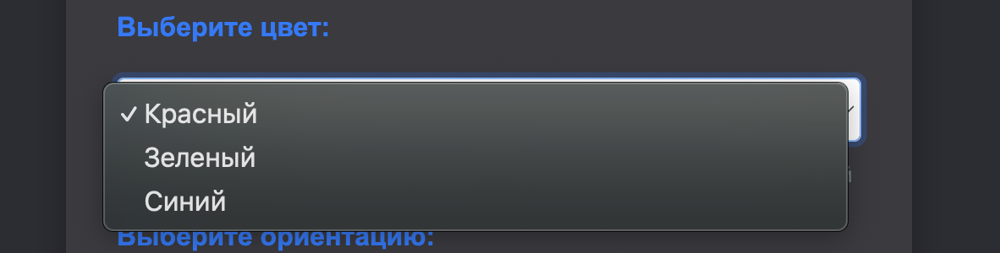
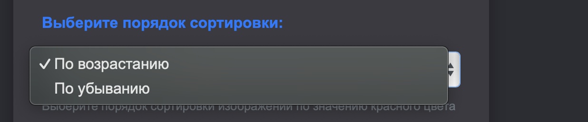
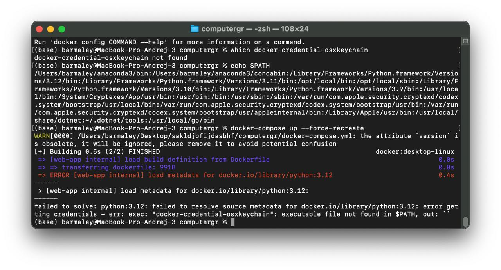
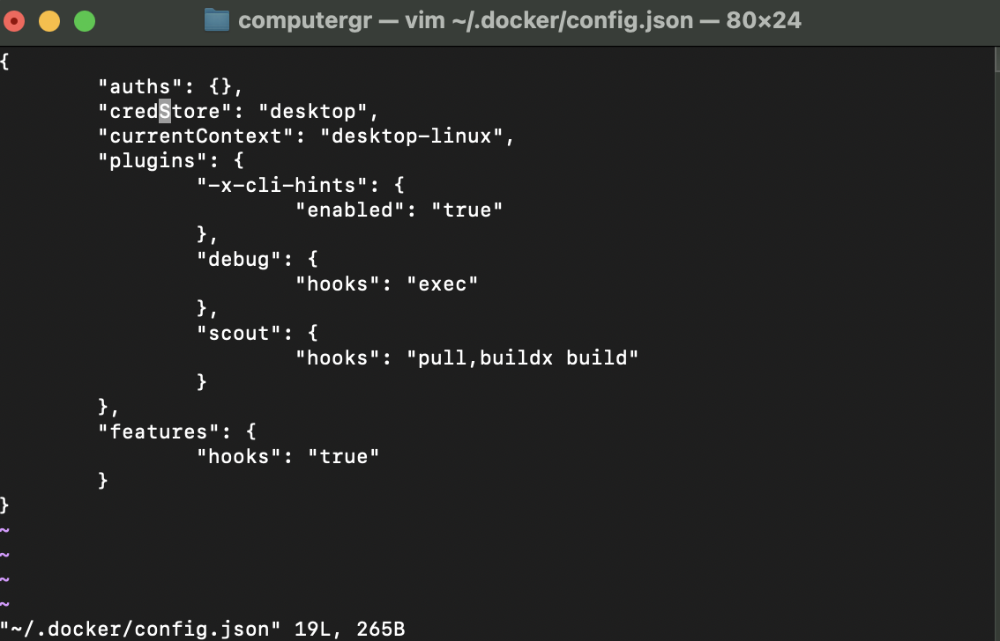

## Описание проекта

Этот проект представляет собой веб-приложение на основе Flask, которое позволяет пользователям загружать изображения и генерировать PDF-файлы, содержащие изображения с доминирующим цветом (красный, зеленый или синий) в соответствии с выбором пользователя. Основные функции:

- Загрузка изображений пользователем.
- Определение доминирующего цвета в загруженных изображениях.
- Генерация PDF-файла с изображениями, сгруппированными по папкам и доминирующим цветам.
- Возможность выбора ориентации PDF (портретная или альбомная).
- Сортировать изображения по цвету, спектр которого выбрал пользовтель.

## Установка

### Установка без Docker

#### Windows

1. **Установите Python**:
   - Скачайте и установите Python с [официального сайта](https://www.python.org/downloads/) (Подойдет версия python от 3.8).

2. **Клонируйте репозиторий**:

   Вам необходимо создать дерикторию в удобном для Вас месте и клонировать репозиторий: 
   ```bash
   mkdir <Имя для вашей папки>
   cd <Имя для вашей папки>
   git clone https://git.miem.hse.ru/assvistunov/computergr.git
   cd awesomecomputergraphicproject
   ```

3. **Установите зависимости**:
   ```bash
   pip install -r requirements.txt
   ```

4. **Запустите приложение**:
   ```bash
   python main.py
   ```
   Откройте веб-браузер и перейдите по указанному в терминале адресу.

#### macOS

1. **Установите Python**:
   - Для macOS можно использовать утилиту Homebrew (скачать Homebrew можно по этой [ссылке](https://brew.sh/ru/)):
   ```bash
   brew install python
   ```

2. **Клонируйте репозиторий**:
   ```bash
   mkdir <Имя для вашей папки>
   cd <Имя для вашей папки>
   git clone https://git.miem.hse.ru/assvistunov/computergr.git
   cd awesomecomputergraphicproject
   ```

3. **Установите зависимости**:
   ```bash
   pip install -r requirements.txt
   ```

4. **Запустите приложение**:
   ```bash
   python main.py
   ```
   Откройте веб-браузер и перейдите по указанному в терминале адресу.

#### Linux

1. **Установите Python**:
   - Для Ubuntu/Debian:
   ```bash
   sudo apt update
   sudo apt install python3 python3-pip
   ```

2. **Клонируйте репозиторий**:
   ```bash
   mkdir <имя_папки_репозитория>
   cd <имя_папки_репозитория>
   git clone <URL до репозитория>
   cd awesomecomputergraphicproject
   ```

3. **Установите зависимости**:
   ```bash
   pip install -r requirements.txt
   ```

4. **Запустите приложение**:
   ```bash
   python main.py
   ```
   Откройте веб-браузер и перейдите по указанному в терминале адресу.

---

### Установка с Docker

1. **Установите Docker**:
   - Скачайте и установите Docker с [официального сайта](https://www.docker.com/products/docker-desktop).
   - Если потребуется, то установите дополнительные пакеты и прочее для корректной работы.

2. **Клонируйте репозиторий**:
   ```bash
   mkdir <Имя для вашей папки>
   cd <Имя для вашsей папки>
   git clone https://git.miem.hse.ru/assvistunov/computergr.git
   cd awesomecomputergraphicproject
   ```

3. **Соберите образ Docker**:
   ```bash
   docker-compose build
   ```

4. **Запустите контейнер**:
   ```bash
   docker-compose up
   ```
   Откройте веб-браузер и перейдите по адресу `http://localhost`.
5. **Завершить работу контейнера**:
   ```bash
   docker-compose down
   ```

## Использование

### Вы можете воспользоваться файлами из папки `TestPhotos` для проверки работы проекта.

1. Перейдите на главную страницу приложения по адресу `http://localhost`.
   
2. Загрузите одно или несколько изображений.
   - Нажмите на иконку: `Выбрать файлы`
   
   - Выберете один или несколько файлов для отбора
   
3. Выберите доминирующий цвет, ориентацию PDF и вид сортировки.
   ---

   

   ---

   

   ---

   

   ---
   
4. Нажмите кнопку для генерации PDF-файла, который будет автоматически загружен (необходимо подождать некоторое время).
   


# P.S
У вас может возникнуть проблема с запуском приложения через docker на MacOS.

Если у Вас возникла подобная ошибка:


То вам необходимо выполнить команду:
```bash
vim ~/.docker/config.json
```

И отредактировать `credsStore` на `credStore`:

